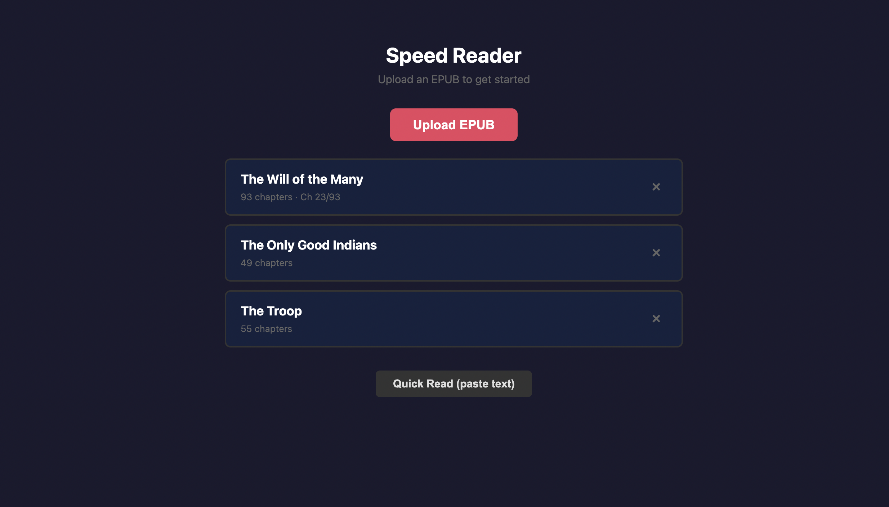
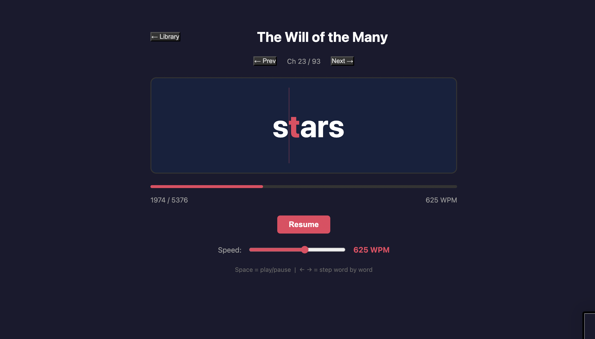

# Speed Reader

A web-based speed reading app using RSVP (Rapid Serial Visual Presentation) with ORP (Optimal Recognition Point) highlighting.

## Screenshots

### Library View


### Reader View


## Features

- Upload and read EPUB books with chapter navigation
- Paste text for quick reading sessions
- Adjustable speed (100-1000 WPM)
- Smart pacing based on punctuation and word length
- Automatic progress saving
- ORP highlighting for faster comprehension
- Keyboard shortcuts: `Space` (play/pause), `←/→` (step word by word)

## Quick Start

```bash
npm install
npm run dev        # Development server
npm start          # Production build + server
```

## How It Works

RSVP displays one word at a time in a fixed position, eliminating eye movement. The ORP (red letter) marks where your eye should focus for optimal recognition, enabling faster reading with better comprehension.

## Tech Stack

React + Vite, Express, JSZip for EPUB parsing
